# ResFood App

ResFood là ứng dụng Android đặt món, đặt bàn và quản lý nhà hàng được xây dựng bằng Kotlin Jetpack Compose. Ứng dụng sử dụng Firebase làm backend chính để quản lý tài khoản, món ăn, giỏ hàng, đơn hàng, khuyến mãi, chat và thông báo; đồng thời có backend Node.js/Express để tạo QR thanh toán SePay và nhận webhook xác nhận thanh toán.

## Tổng quan

Với ResFood, khách hàng có thể:

- Đăng ký, đăng nhập bằng email/password hoặc Google.
- Xem danh sách món ăn, tìm kiếm, lọc món và xem chi tiết món.
- Chọn topping, thêm món vào giỏ hàng và đặt món.
- Quản lý nhiều địa chỉ giao hàng.
- Chọn tọa độ địa chỉ trên bản đồ.
- Áp dụng voucher giảm giá món ăn hoặc giảm phí giao hàng.
- Thanh toán bằng COD hoặc QR SePay.
- Theo dõi trạng thái đơn hàng theo thời gian thực.
- Đánh giá đơn hàng/món ăn sau khi hoàn thành.
- Lưu món ăn yêu thích theo tài khoản.
- Đặt bàn tại nhà hàng.
- Chat realtime với admin.
- Nhận thông báo đơn hàng, đặt bàn và khuyến mãi.
- Quản lý hồ sơ cá nhân, ảnh đại diện, mật khẩu, theme, hạng thành viên, mã giới thiệu và thống kê chi tiêu.

Admin có thể:

- Xem dashboard vận hành nhà hàng.
- Quản lý món ăn, topping, khách hàng, đơn hàng, bàn, đặt bàn, chi nhánh và khuyến mãi.
- Thêm/sửa/xóa món ăn, topping và voucher.
- Cập nhật trạng thái đơn hàng.
- Từ chối đơn hàng hoặc yêu cầu đặt bàn kèm lý do.
- Chat với khách hàng.
- Quản lý đánh giá.
- Xem thống kê doanh thu và món bán chạy.

## Tech Stack

- **Language:** Kotlin
- **UI:** Jetpack Compose, Material 3, Compose Navigation
- **Architecture:** MVVM, ViewModel, StateFlow, Repository
- **Async:** Kotlin Coroutines
- **Backend-as-a-Service:** Firebase Authentication, Cloud Firestore, Firebase Storage, Firebase Cloud Messaging
- **Authentication:** Email/password, Google Sign-In
- **Network:** Retrofit, OkHttp, Gson
- **Image Loading:** Coil Compose
- **Image Upload:** ImgBB, Cloudinary
- **Map & Location:** Google Play Services Location, osmdroid, Nominatim, OpenRouteService
- **Payment Backend:** Node.js, Express, Firebase Admin SDK, SePay QR, ngrok
- **Build:** Gradle Kotlin DSL, Android Gradle Plugin, Kotlin Compose plugin
- **Platform:** compileSdk 36, minSdk 29, targetSdk 36, JDK 17 để chạy Gradle, JVM target 11

## Chức năng chính

### Authentication

- Splash screen kiểm tra phiên đăng nhập hiện tại.
- Đăng ký tài khoản khách hàng.
- Đăng nhập bằng email/password.
- Đăng nhập bằng Google Sign-In.
- Quên mật khẩu qua Firebase Authentication.
- Đăng xuất.
- Xóa tài khoản.
- Kiểm tra trạng thái khóa tài khoản.
- Phân quyền theo role `customer` và `admin`.
- Điều hướng sau đăng nhập dựa trên role:
  - `customer` vào `home`.
  - `admin` vào `admin_dashboard`.

### Home & Food Menu

- Hiển thị danh sách món ăn từ Cloud Firestore.
- Phân loại món theo category.
- Tìm kiếm món theo tên.
- Lọc món bằng `HomeFilterDialog`.
- Hiển thị ảnh món bằng Coil Compose.
- Hiển thị giá, giá giảm, calories, rating và trạng thái còn bán.
- Điều hướng tới màn hình chi tiết món.
- Hỗ trợ deep link chi tiết món qua:

```text
resfood://food/{foodId}
```

### Food Detail

- Hiển thị ảnh, tên món, giá, giảm giá, mô tả, calories và rating.
- Hiển thị danh sách topping có thể chọn.
- Thêm món vào giỏ hàng kèm số lượng, topping và ghi chú.
- Thêm hoặc xóa món khỏi danh sách yêu thích.
- Mở danh sách đánh giá của món.
- Chia sẻ thông tin món qua Android share sheet.

### Cart

- Lấy giỏ hàng theo từng user từ Firestore.
- Hiển thị danh sách món trong giỏ.
- Tăng/giảm số lượng món.
- Chọn hoặc bỏ chọn item để checkout.
- Xóa món khỏi giỏ hàng.
- Mở lại màn hình chi tiết món từ cart.
- Tính tổng tiền các item được chọn.

### Checkout

- Lấy các item đang được chọn trong giỏ hàng.
- Chọn địa chỉ giao hàng.
- Lấy địa chỉ mặc định của user nếu có.
- Tính tạm tính, phí giao hàng, giảm giá sản phẩm, giảm phí ship và tổng tiền.
- Chọn voucher giảm giá đơn hàng hoặc voucher giảm phí ship.
- Hỗ trợ thanh toán COD.
- Hỗ trợ thanh toán QR SePay.
- Xóa các item đã thanh toán khỏi giỏ hàng bằng Firestore batch.
- Điều hướng sang danh sách đơn hàng sau khi đặt hàng thành công.

### Payment

- Khi thanh toán COD, đơn hàng được tạo trực tiếp với trạng thái chờ xử lý.
- Khi thanh toán SePay, app tạo order và gọi backend Express để lấy QR.
- Backend tạo QR từ endpoint của SePay:

```text
https://qr.sepay.vn/img
```

- Backend nhận webhook SePay khi có tiền vào.
- Backend kiểm tra order id và số tiền giao dịch.
- Nếu hợp lệ, backend cập nhật đơn hàng:

```text
WAITING_PAYMENT -> PENDING
```

- App lắng nghe trạng thái đơn hàng realtime để xác nhận thanh toán thành công.

### Address & Map

- Quản lý nhiều địa chỉ giao hàng trong profile.
- Thêm, sửa, xóa địa chỉ.
- Đặt địa chỉ mặc định.
- Chọn địa chỉ khi checkout.
- Chọn tọa độ trên bản đồ bằng osmdroid.
- Reverse geocoding và tìm kiếm địa chỉ bằng Nominatim.
- Tính tuyến đường/khoảng cách bằng OpenRouteService.
- Tính phí ship động dựa trên tọa độ chi nhánh và địa chỉ giao hàng.

### Orders & Reviews

- Xem danh sách đơn hàng theo trạng thái.
- Xem chi tiết đơn hàng.
- Theo dõi cập nhật đơn hàng realtime từ Firestore.
- Chat với admin từ chi tiết đơn.
- Đánh giá đơn hàng/món ăn sau khi đơn hoàn thành.
- Đánh dấu đơn đã review để tránh đánh giá lặp.

Các trạng thái đơn hàng chính:

```text
WAITING_PAYMENT, PENDING, PROCESSING, DELIVERING, COMPLETED, CANCELLED, REJECTED
```

### Favorites

- Lưu món ăn yêu thích theo từng user.
- Kiểm tra trạng thái yêu thích khi mở chi tiết món.
- Thêm hoặc xóa món khỏi danh sách yêu thích.
- Hiển thị danh sách món yêu thích trong favorite gallery.
- Yêu cầu đăng nhập trước khi dùng tính năng yêu thích.

### Membership

- Theo dõi tổng chi tiêu tích lũy của user.
- Tính hạng thành viên.
- Hiển thị điểm và quyền lợi thành viên.
- Ghi nhận reward đã nhận.
- Cập nhật rank trong document `users`.

### Voucher & Promotion

- Hỗ trợ voucher public cho tất cả user.
- Hỗ trợ voucher private chỉ gán cho một số user.
- Hỗ trợ giảm theo phần trăm hoặc số tiền cố định.
- Hỗ trợ voucher áp dụng cho đơn hàng hoặc phí ship.
- Kiểm tra điều kiện dùng voucher:
  - Còn hiệu lực.
  - Đang active.
  - Đạt giá trị đơn tối thiểu.
  - Còn số lượng.
  - User có quyền dùng.
  - User chưa dùng quá quota.
- Admin có thể tạo/sửa/xóa voucher và gửi thông báo khi tạo promotion.

### Referral

- Mỗi user có mã giới thiệu riêng.
- User mới có thể nhập mã giới thiệu trong 24 giờ đầu.
- Lưu người giới thiệu và danh sách user được giới thiệu.
- Hiển thị lịch sử giới thiệu.
- Tạo promotion thưởng referral.

### Booking Table

- Khách hàng tạo yêu cầu đặt bàn.
- Chọn chi nhánh, thời gian, số khách và ghi chú.
- Xem danh sách đặt bàn theo trạng thái.
- Xem chi tiết đặt bàn.
- Admin quản lý bàn và yêu cầu đặt bàn.
- Admin có thể xác nhận, hoàn thành, hủy hoặc từ chối đặt bàn.

Các trạng thái đặt bàn chính:

```text
PENDING, CONFIRMED, COMPLETED, CANCELLED, REJECTED
```

### Chat

- Chat realtime giữa khách hàng và admin bằng Cloud Firestore.
- Admin xem danh sách hội thoại.
- Khách hàng chat với admin từ profile hoặc chi tiết đơn hàng.
- Lưu tin nhắn trong subcollection `messages`.
- Theo dõi tin nhắn chưa đọc.
- Cập nhật metadata cuộc trò chuyện bằng Firestore transaction.

### Notification

- Nhận push notification qua Firebase Cloud Messaging.
- Xin quyền `POST_NOTIFICATIONS` trên Android 13+.
- Tạo notification channel khi app khởi động.
- Lưu thông báo trong collection `notifications`.
- Hiển thị danh sách thông báo trong app.
- Đánh dấu đã đọc hoặc đánh dấu tất cả đã đọc.
- Điều hướng từ thông báo tới:
  - Chi tiết đơn hàng.
  - Chi tiết đặt bàn.
  - Ví voucher.

### Profile & Settings

- Xem và cập nhật thông tin cá nhân.
- Upload avatar qua ImgBB.
- Đổi mật khẩu.
- Xóa tài khoản.
- Quản lý địa chỉ từ profile.
- Quản lý theme sáng/tối.
- Hỗ trợ đa ngôn ngữ qua resource `values`, `values-vi`, `values-en`.
- Khai báo `localeConfig` trong manifest.

### Admin Dashboard

- Hiển thị tổng doanh thu.
- Hiển thị số đơn mới/chờ xử lý/đang xử lý.
- Hiển thị số booking.
- Hiển thị món hết hàng.
- Hiển thị hoạt động gần đây.
- Điều hướng nhanh tới các màn quản lý chính.

### Admin Food & Topping

- Xem danh sách món ăn.
- Lọc theo category và trạng thái còn hàng.
- Thêm món mới.
- Sửa thông tin món.
- Xóa món.
- Quản lý tên, mô tả, giá, ảnh, calories, category và trạng thái.
- Quản lý danh sách topping.
- Thêm/sửa/xóa topping.
- Upload ảnh món/topping.

### Admin Orders

- Xem toàn bộ đơn hàng realtime.
- Lọc đơn theo trạng thái.
- Tìm kiếm đơn theo mã đơn, tên khách hoặc số điện thoại.
- Xem chi tiết đơn hàng.
- Cập nhật trạng thái đơn.
- Từ chối đơn kèm lý do.
- Chat với khách hàng từ đơn hàng.
- Xem đơn hàng theo từng khách hàng.

### Admin Customers

- Xem danh sách khách hàng.
- Tìm kiếm khách hàng.
- Cập nhật thông tin khách hàng.
- Khóa/mở khóa tài khoản.
- Xem đơn hàng của từng khách.
- Chat với khách hàng.

### Admin Promotions

- Xem danh sách khuyến mãi.
- Thêm khuyến mãi mới.
- Sửa/xóa khuyến mãi.
- Chọn public/private voucher.
- Chọn khách hàng được gán voucher private.
- Cấu hình số lượng voucher và quota theo user.
- Gửi thông báo promotion cho khách hàng.

### Admin Tables & Branches

- Quản lý danh sách bàn.
- Quản lý yêu cầu đặt bàn.
- Xem chi tiết đặt bàn.
- Xác nhận/từ chối yêu cầu đặt bàn.
- Quản lý chi nhánh chính.
- Lưu địa chỉ, tọa độ, phí ship tối thiểu và phí ship theo km.
- Chọn tọa độ chi nhánh bằng map picker.

### Admin Reviews & Analytics

- Quản lý đánh giá của khách hàng.
- Xem thống kê doanh thu theo hôm nay, tuần, tháng hoặc khoảng thời gian tùy chỉnh.
- Xem biểu đồ doanh thu.
- Thống kê trạng thái đơn hàng.
- Thống kê món bán chạy theo số lượng/doanh thu.

## Cấu trúc dự án

```text
.
├── app/
│   ├── build.gradle.kts
│   └── src/
│       ├── google-services.json
│       └── main/
│           ├── AndroidManifest.xml
│           ├── java/com/muatrenthenang/resfood/
│           │   ├── MainActivity.kt
│           │   ├── data/
│           │   │   ├── api/          # Retrofit API service/client
│           │   │   ├── model/        # Data model của app
│           │   │   ├── remote/       # OpenRouteService client/model
│           │   │   └── repository/   # Repository xử lý Firebase/API
│           │   ├── service/          # FCM service và local notification
│           │   ├── ui/
│           │   │   ├── components/   # Component Compose dùng lại
│           │   │   ├── layout/       # AppLayout và bottom navigation
│           │   │   ├── screens/      # Màn hình customer/admin
│           │   │   ├── theme/        # Theme, color, typography
│           │   │   └── viewmodel/    # ViewModel theo từng chức năng
│           │   └── util/             # Helper tiền tệ, notification
│           └── res/                  # Drawable, strings, themes, xml config
├── backend/
│   ├── package.json
│   └── src/
│       ├── app.js
│       ├── server.js
│       ├── config/                   # Firebase Admin và SePay config
│       ├── controllers/              # Payment controller
│       ├── routes/                   # Payment routes
│       └── services/                 # Payment service
├── docs/                             # Hướng dẫn cấu hình SePay
├── gradle/                           # Gradle wrapper và version catalog
├── build.gradle.kts
├── settings.gradle.kts
└── README.md
```

## Yêu cầu

- Android Studio Hedgehog hoặc mới hơn.
- JDK 17.
- Android SDK 29+.
- Node.js và npm.
- Firebase project.
- Tài khoản Google Cloud/Firebase để cấu hình Google Sign-In.
- Tài khoản/API key ImgBB.
- Tài khoản/API key OpenRouteService.
- Tài khoản SePay và tài khoản ngân hàng liên kết nếu dùng thanh toán QR.
- ngrok authtoken nếu cần public webhook cho backend local.

## Cài đặt

### 1. Clone project

```bash
git clone https://github.com/datkrb/ResFood-App.git
cd ResFood-App
```

### 2. Cấu hình Firebase

1. Tạo Firebase project.
2. Thêm Android app với package name:

```text
com.muatrenthenang.resfood
```

3. Tải file `google-services.json` và đặt vào:

```text
app/src/google-services.json
```

4. Bật các dịch vụ Firebase sau:

- Authentication với Email/password.
- Authentication với Google Sign-In.
- Cloud Firestore.
- Firebase Storage.
- Firebase Cloud Messaging.

### 3. Cấu hình Google Web Client ID

Mở file:

```text
app/src/main/res/values/strings.xml
```

Thay giá trị Web Client ID lấy từ Firebase/Google Cloud:

```xml
<string name="default_web_client_id">YOUR_WEB_CLIENT_ID</string>
```

### 4. Cấu hình API key Android

Tạo hoặc cập nhật file `local.properties` trong thư mục root:

```properties
sdk.dir=/path/to/your/android/sdk
imgbb.api.key=YOUR_IMGBB_API_KEY
openrouteservice.api.key=YOUR_OPENROUTESERVICE_API_KEY
NGROK_URL=https://your-ngrok-domain.ngrok-free.app/
```

`NGROK_URL` cần có dấu `/` ở cuối vì app dùng giá trị này làm Retrofit `baseUrl`.

### 5. Cấu hình backend thanh toán

Cài đặt dependencies backend:

```bash
cd backend
npm install
```

Tạo Firebase Admin private key trong Firebase Console:

```text
Project settings -> Service accounts -> Generate new private key
```

Đổi tên file thành:

```text
serviceAccountKey.json
```

Đặt file vào:

```text
backend/serviceAccountKey.json
```

Tạo file `.env` trong thư mục `backend/`:

```env
BANK_ID=YOUR_BANK_ID
ACCOUNT_NO=YOUR_BANK_ACCOUNT_NUMBER
NGROK_AUTHTOKEN=YOUR_NGROK_AUTHTOKEN
```

Ví dụ `BANK_ID`: `VCB`, `MB`, `ACB`, `BIDV`.

### 6. Cấu hình SePay webhook

Trên SePay, tạo webhook cho sự kiện có tiền vào và trỏ URL callback về:

```text
https://your-ngrok-domain.ngrok-free.app/api/v1/payments/sepay/webhook
```

Backend có các endpoint chính:

```http
POST /api/v1/payments/sepay/create
POST /api/v1/payments/sepay/webhook
```

Chi tiết cấu hình SePay có trong:

```text
docs/GUIDE.md
```

## Chạy ứng dụng

### Chạy backend

```bash
cd backend
npm run dev
```

Server mặc định chạy ở port `3000`. Khi dùng SePay thật, webhook cần public URL từ ngrok.

### Chạy Android app

1. Mở project bằng Android Studio.
2. Đợi Gradle sync hoàn tất.
3. Kết nối thiết bị thật hoặc khởi động emulator.
4. Nhấn **Run** hoặc `Shift + F10`.

Hoặc build bằng terminal:

```bash
./gradlew assembleDebug
```

Chạy unit test:

```bash
./gradlew test
```

## Dữ liệu Firebase

Các collection chính được sử dụng:

- `users`: hồ sơ người dùng, role, rank, điểm, tổng chi tiêu, địa chỉ, referral và trạng thái khóa.
- `foods`: món ăn, giá, ảnh, category, calories, rating, review và trạng thái còn bán.
- `toppings`: topping, giá và ảnh.
- `carts/{userId}/cartItems`: giỏ hàng theo từng user.
- `orders`: đơn hàng, item, voucher, phí ship, trạng thái, phương thức thanh toán và thông tin review.
- `promotions`: voucher, loại giảm giá, thời hạn, quota, user được gán và trạng thái active.
- `favorites/{userId}/items`: danh sách món yêu thích theo từng user.
- `tables`: danh sách bàn nhà hàng.
- `reservations`: yêu cầu đặt bàn.
- `branches`: chi nhánh, địa chỉ, tọa độ, phí ship tối thiểu và phí ship theo km.
- `chats/{chatId}/messages`: hội thoại và tin nhắn realtime.
- `notifications`: thông báo trong app.
- `reviews`: đánh giá món ăn/đơn hàng.

Project có `DataSeeder.kt` để seed dữ liệu mẫu cho `foods`, `tables`, `promotions`, `users` và `orders` khi cần test nhanh.

## Firestore rules tham khảo

Rules thực tế có thể thay đổi theo yêu cầu triển khai, nhưng có thể bắt đầu với nguyên tắc: user chỉ được đọc/ghi dữ liệu cá nhân của mình, admin được quản lý dữ liệu vận hành.

```javascript
rules_version = '2';
service cloud.firestore {
  match /databases/{database}/documents {
    function signedIn() {
      return request.auth != null;
    }

    function isOwner(userId) {
      return signedIn() && request.auth.uid == userId;
    }

    function isAdmin() {
      return signedIn()
        && get(/databases/$(database)/documents/users/$(request.auth.uid)).data.role == "admin";
    }

    match /users/{userId} {
      allow read, update, delete: if isOwner(userId) || isAdmin();
      allow create: if isOwner(userId) || isAdmin();
    }

    match /foods/{foodId} {
      allow read: if true;
      allow write: if isAdmin();
    }

    match /toppings/{toppingId} {
      allow read: if true;
      allow write: if isAdmin();
    }

    match /carts/{userId}/cartItems/{itemId} {
      allow read, write: if isOwner(userId);
    }

    match /favorites/{userId}/items/{itemId} {
      allow read, write: if isOwner(userId);
    }

    match /orders/{orderId} {
      allow read: if isAdmin() || (signedIn() && resource.data.userId == request.auth.uid);
      allow create: if signedIn() && request.resource.data.userId == request.auth.uid;
      allow update: if isAdmin();
      allow delete: if isAdmin();
    }

    match /promotions/{promotionId} {
      allow read: if signedIn();
      allow write: if isAdmin();
    }

    match /tables/{tableId} {
      allow read: if signedIn();
      allow write: if isAdmin();
    }

    match /reservations/{reservationId} {
      allow read: if isAdmin() || (signedIn() && resource.data.user_id == request.auth.uid);
      allow create: if signedIn();
      allow update, delete: if isAdmin();
    }

    match /branches/{branchId} {
      allow read: if true;
      allow write: if isAdmin();
    }

    match /chats/{chatId} {
      allow read, write: if isAdmin() || isOwner(chatId);

      match /messages/{messageId} {
        allow read, write: if isAdmin() || isOwner(chatId);
      }
    }

    match /notifications/{notificationId} {
      allow read, update, delete: if isAdmin()
        || (signedIn() && resource.data.userId == request.auth.uid);
      allow create: if isAdmin()
        || (signedIn() && request.resource.data.userId == request.auth.uid);
    }

    match /reviews/{reviewId} {
      allow read: if true;
      allow create: if signedIn();
      allow update, delete: if isAdmin();
    }
  }
}
```

## Lưu ý cấu hình

- Không commit `local.properties`, `.env`, `serviceAccountKey.json` hoặc API key thật.
- `NGROK_URL` phải khớp với public URL đang chạy backend.
- Khi đổi ngrok URL, cần cập nhật cả `local.properties` và webhook trên SePay.
- File `google-services.json` trong project này đang được đặt tại `app/src/google-services.json`.
- Manifest đang bật `usesCleartextTraffic="true"` để thuận tiện khi phát triển local.
- Manifest có khai báo deep link `resfood://food/{foodId}` cho chi tiết món.
- Manifest còn có scheme `demozpdk://app` phục vụ luồng thanh toán/redirect cũ nếu cần tương thích.

## Demo giao diện bên phía user

| Trang chủ | Chi tiết món ăn | Món yêu thích |
|---|---|---|
| 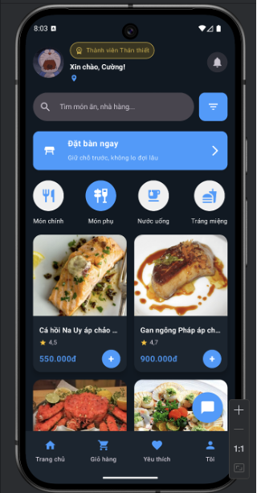 | 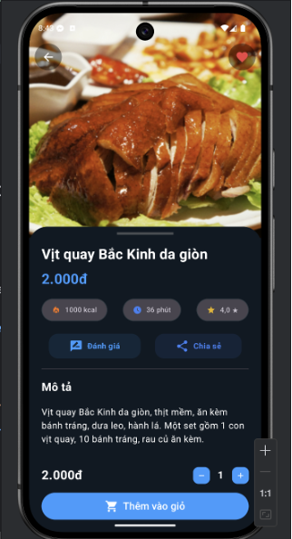 | 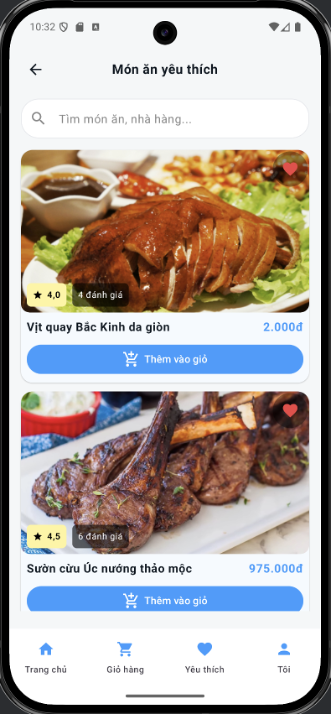 |

| Đặt món | Xác nhận đặt món | Chi tiết đơn hàng |
|---|---|---|
| 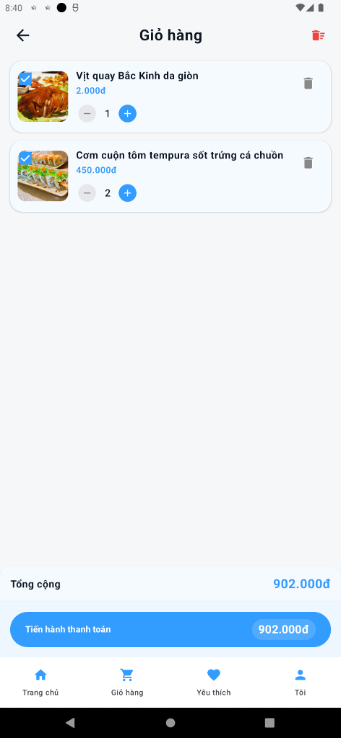 | 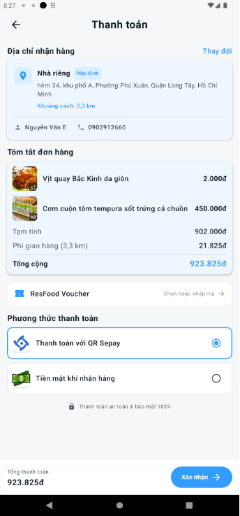 | 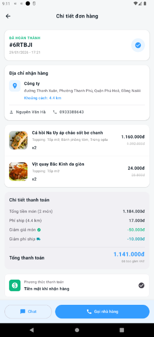 |

| Thanh toán SePay | Thanh toán thành công | Voucher |
|---|---|---|
| 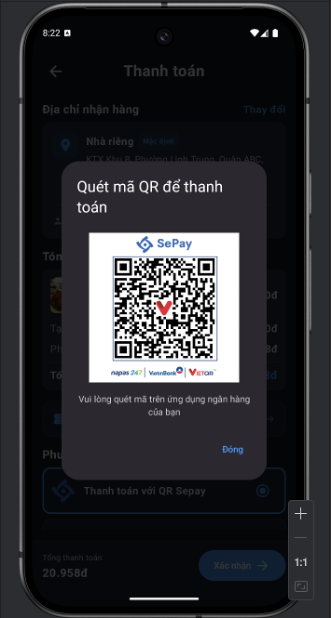 | 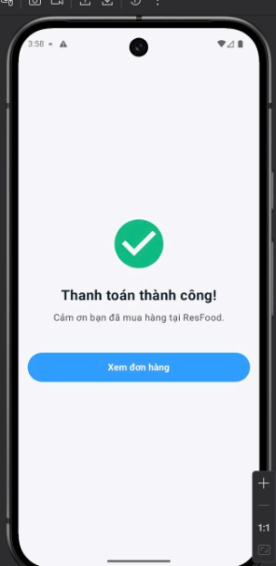 | 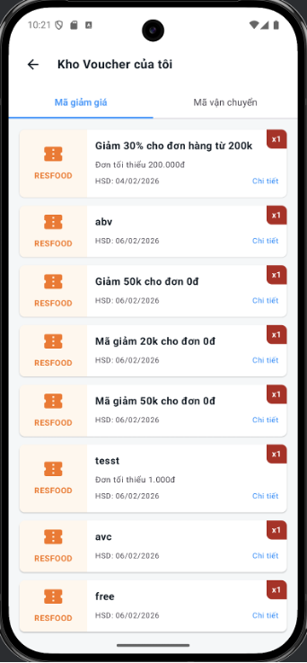 |

| Đặt bàn trực tuyến | Chat realtime | Hội thoại với admin |
|---|---|---|
| 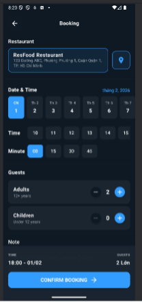 | 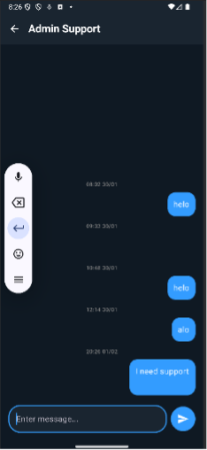 | 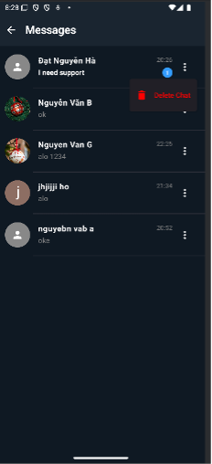 |

| Hồ sơ người dùng | Hạng thành viên | Thống kê chi tiêu |
|---|---|---|
| 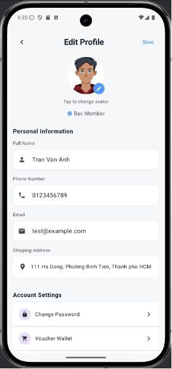 | 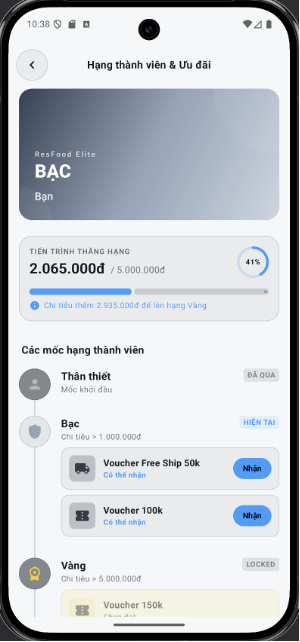 | 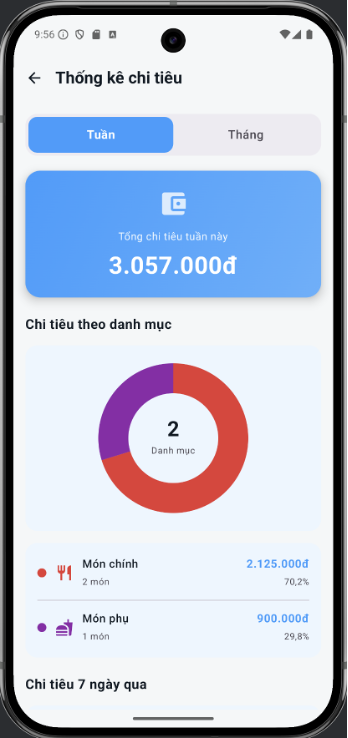 |

| Đánh giá món ăn | Gửi đánh giá | Thông báo khuyến mãi |
|---|---|---|
| 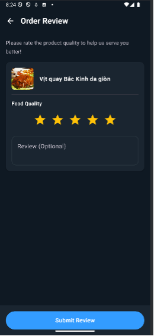 | 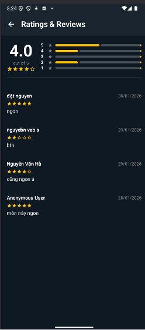 | 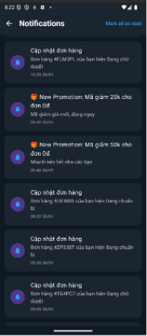 |
