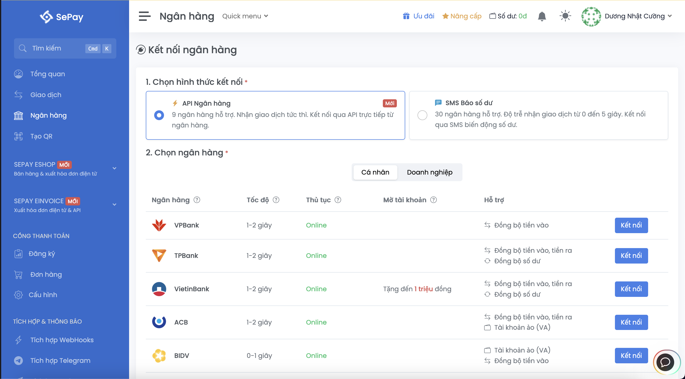
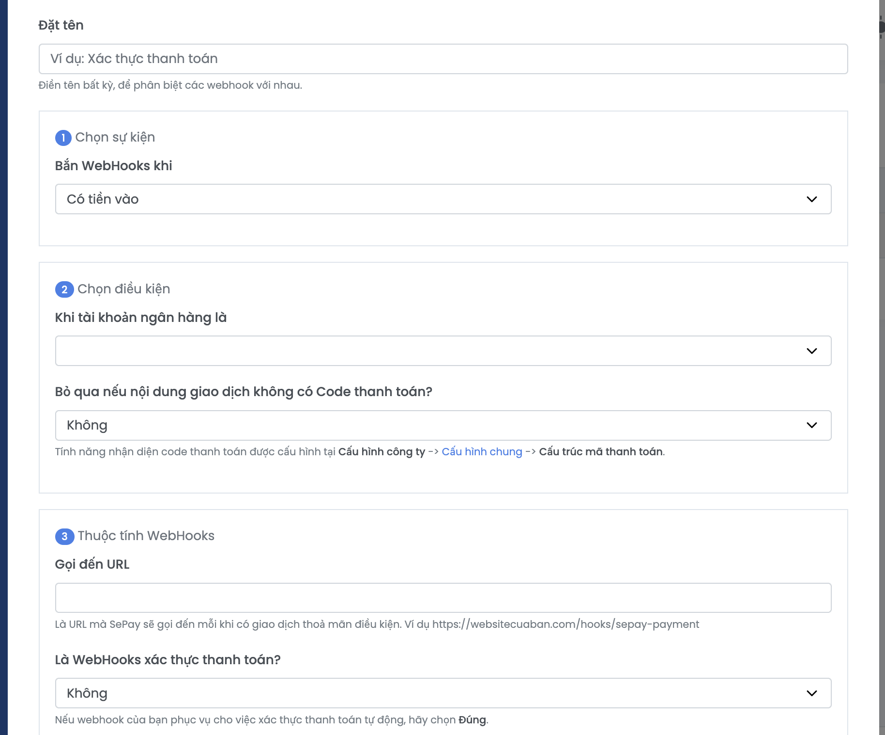
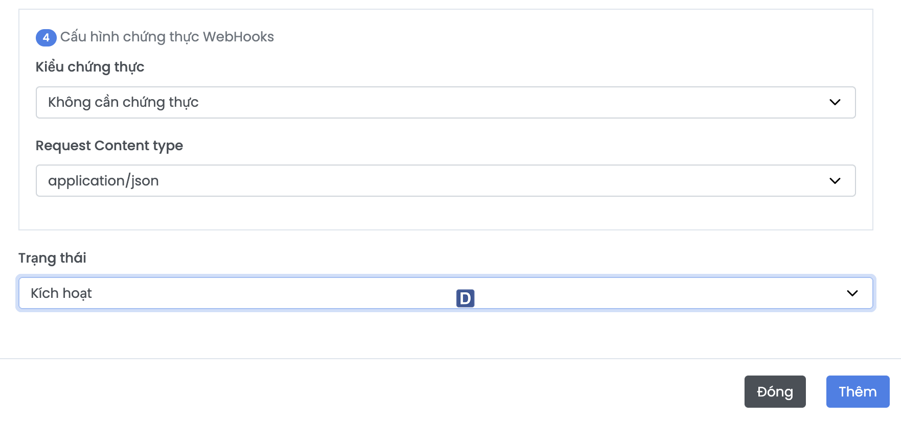

## GUIDE Thêm thanh toán:

## Bước 1:
- Chạy backend và ngrok để tạo link api công khai:

```bash
npm run dev
ngrok http 3000
```

Nó sẽ có dạng như sau: `https://abcd1234.ngrok-free.dev`, lấy cái link này, mở file `local.properties` và thêm dòng sau:

```zsh
NGROK_URL=https://abcd1234.ngrok-free.dev/
```

> Nhớ có dấu `/` ở cuối.

## Bước 2: Lên sepay web, tạo tài khoản và đăng nhập:

- Truy cập: [https://sepay.vn/](https://sepay.vn/)


- Tiếp theo, dô phần `Ngân hàng`, liên kết ngân hàng của m với cái tài khoản sepay vừa tạo (chọn đúng ngân hàng có trong này và đang sài)



> Nhấn dô `kết nối` và làm theo hướng dẫn của tụi nó.

## Bước 3: Dô phần `Tích hợp Webhook`

- Chọn `Thêm webhooks`



### Điền thông tin như sau:

- Đặt tên: Sepay Callback, hoặc cái gì đó định nghĩa là dc
- Chọn sự kiện: Có tiền vào (Vì cần nhận thông báo khi có tiền vào tài khoản sepay)
- Chọn điều kiện: 
    + Khi tài khoản ngân hàng là: Chọn cái tài khoản ngân hàng mà m vừa liên kết ở bước 2
    + Bỏ qua nếu nội dung giao dịch không có Code thanh toán?: Không
- Thuộc tính WebHooks
    + Gọi đến URL: `${NGROK_URL}/api/v1/payments/sepay/webhook` (link ở bước 1)
    + Là WebHooks xác thực thanh toán?: Đúng
-  Gọi lại Webhooks khi? HTTP Status Code không nằm trong phạm vi từ 200 đến 299.: tick dô luôn nha,



Mấy cái còn lại thì để nguyên như này, rồi nhấn `Thêm`.

## Bước 4: 

M dô firebase console, dô project, vô project settings (cái bánh răng), dô services accounts, rồi nhấn `Generate new private key`, tải file json đó về.

Xong đổi tên file đó thành `serviceAccountKey.json`, rồi để dô thư mục gốc của backend. (Có file này mới truy cập dô firebase để set trạng thái dc)

```zsh
/backend
  |-- serviceAccountKey.json
  |-- src/
  |-- ...
```

## Bước 5:
Tạo file `.env`, rồi thêm các trường sau (tài khoản liên kết với cái sepay ở bước 2):

```zsh
BANK_ID= mã viết tắt ngân hàng của m (VCB, MB, ACB, BIDV gì đó)
ACCOUNT_NO= số tài khoản ngân hàng m liên kết với sepay
```

xong thì run app android + ngrok + backend r chạy thử. T có test dưới postman là chạy r ấy, giờ link dô với tài khoản thật thôi.

- Lưu ý: Chuyển này là chuyển tiền thật dô cái tài khoản ngân hàng liên kết với sepay nha, nên dùng momo chuyển sang ngân hàng để test nha, có gì tạo thêm mấy món giá thấp thấp để chuyển thử là dc